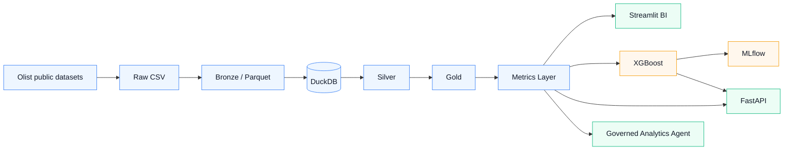
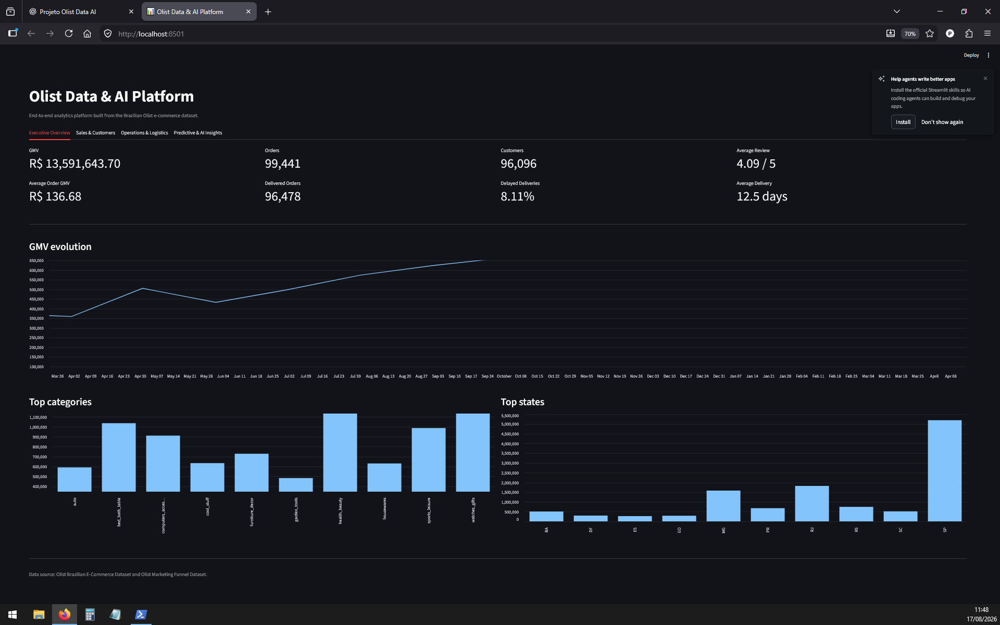
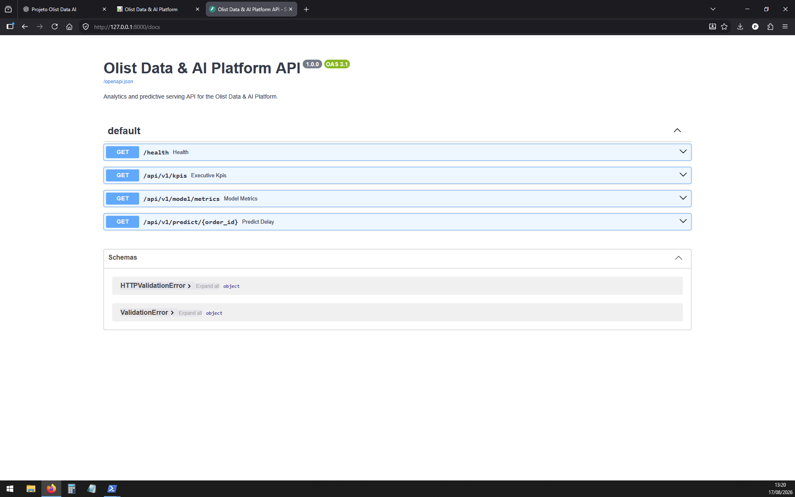

# Olist Data & AI Platform

> **End-to-end, local-first Data & AI portfolio platform built on public Brazilian e-commerce data.**


## Overview

The **Olist Data & AI Platform** is an executable portfolio project that connects Data Engineering, analytical modeling, Business Intelligence, Machine Learning, experiment tracking, API serving and governed analytical tooling over the same data foundation.

The current MVP runs locally on Windows with Python 3.12 and does **not** require Docker, WSL or a cloud account.

The repository also preserves a broader production-oriented target architecture. Components that belong only to that future architecture are explicitly identified as such.

## Executable architecture



The implemented path is:

```text
Sources → Raw → Bronze → Silver → Gold → Metrics
                                   ├─ Streamlit BI
                                   ├─ XGBoost / MLflow
                                   ├─ FastAPI
                                   └─ Governed Analytics Agent
```

## Project preview

### Executive dashboard

The Streamlit dashboard exposes executive, sales, customer, operations, logistics and predictive-readiness views over the governed analytical layer.



### Predictive API

FastAPI exposes health, executive KPI, model-metric and order-level delivery-delay prediction endpoints through an OpenAPI/Swagger interface.



## What is implemented

The executable MVP includes:

- controlled ingestion of 11 Olist source CSV files;
- source metadata and SHA-256 checksums;
- Bronze materialization in Snappy-compressed Parquet;
- DuckDB analytical warehouse;
- normalized Silver entities;
- Gold facts and dimensions;
- shared Metrics Layer;
- Streamlit analytical dashboard;
- delivery-delay risk model with XGBoost;
- temporal 70/15/15 train/validation/test split;
- validation-only classification-threshold selection;
- local MLflow tracking with SQLite;
- persisted model bundle;
- FastAPI analytical and predictive serving;
- governed, deterministic analytical agent with read-only access;
- 12 end-to-end integration tests;
- Ruff static validation;
- GitHub Actions static repository validation.

The current agent is deliberately **not** presented as an LLM-backed generative agent.

## Current analytical snapshot

| Metric | Value |
|---|---:|
| Orders | 99,441 |
| Unique customers | 96,096 |
| Delivered orders | 96,478 |
| Canceled orders | 625 |
| GMV | R$ 13,591,643.70 |
| Average order GMV | R$ 136.68 |
| Average review score | 4.09 / 5 |
| Delayed deliveries | 8.11% |
| Average delivery time | 12.5 days |

## Data sources

The project uses two public Olist datasets:

### Olist Brazilian E-Commerce Dataset

- customers;
- geolocation;
- orders;
- order items;
- payments;
- reviews;
- products;
- sellers;
- product-category translations.

### Olist Marketing Funnel

- marketing qualified leads;
- closed deals.

Total: **11 CSV files**.

External datasets remain subject to their original licenses and terms.

### Download the public datasets

The repository includes an optional acquisition helper:

```powershell
.\.venv\Scripts\python.exe .\scripts\data\download_olist.py
```

It downloads the two public Kaggle datasets through `kagglehub` and copies the expected CSV files to:

```text
data/raw/
```

You may also place the same 11 CSV files there manually.

## Data architecture

### Bronze

Raw CSV files are read without destructive modification, converted to Parquet and loaded into the `bronze` schema.

The ingestion manifest records:

- source file;
- target table;
- row count;
- file size;
- SHA-256;
- ingestion timestamp.

### Silver

The normalized analytical layer contains:

```text
silver.customers
silver.orders
silver.order_items
silver.order_payments
silver.order_reviews
silver.products
silver.sellers
silver.geolocation_zip
silver.marketing_qualified_leads
silver.closed_deals
```

### Gold

Current Gold assets:

```text
gold.dim_customers
gold.dim_products
gold.fact_orders
gold.fact_order_items
```

### Metrics Layer

Current governed analytical outputs:

```text
metrics.executive_kpis
metrics.monthly_sales
metrics.category_performance
metrics.state_performance
```

BI, API and analytical tools reuse these shared definitions instead of implementing independent KPI logic.

## Metric semantics

### GMV

```text
GMV = sum of item prices transacted in the marketplace
```

GMV is **not equivalent to Olist revenue**.

A category may have higher GMV while having fewer orders, so financial volume and order count are treated as different measures.

### Number of orders

Order volume uses distinct `order_id`.

### Payments

Payment totals are maintained separately from GMV because they represent a different business measure.

### Delivery delay

A delivered order is classified as delayed when:

```text
actual delivery date > estimated delivery date
```

## Business Intelligence

The Streamlit application contains four tabs:

1. Executive Overview
2. Sales & Customers
3. Operations & Logistics
4. Predictive & AI Insights

Run:

```powershell
.\.venv\Scripts\python.exe -m streamlit run .\dashboard\app.py
```

Open:

```text
http://localhost:8501
```

The dashboard is currently a local portfolio application; no public hosted URL is claimed.

## Machine Learning

The main predictive use case is:

```text
delivery_delay_risk
```

### Prediction contract

The model estimates the risk that an order will exceed its estimated delivery date.

Only information available before the delivery outcome is used as a feature.

### Temporal validation

```text
70% training
15% validation
15% test
```

The decision threshold is selected exclusively on the validation partition. The test partition is not used for threshold selection.

### Final test performance

| Metric | Result |
|---|---:|
| ROC AUC | 0.7257 |
| PR AUC | 0.1627 |
| Precision | 0.1438 |
| Recall | 0.5956 |
| F1 | 0.2316 |
| Threshold | 0.41 |
| Test delay rate | 6.61% |

The target is imbalanced. The model is presented as a portfolio risk-ranking use case, not as a production SLA.

Train:

```powershell
.\.venv\Scripts\python.exe .\ml\src\olist_ml\train_delay_model.py
```

Experiment metadata is tracked locally with MLflow and SQLite.

## FastAPI

Start:

```powershell
.\.venv\Scripts\python.exe -m uvicorn olist_api.main:app `
    --app-dir .\api\src `
    --port 8000
```

Swagger UI:

```text
http://127.0.0.1:8000/docs
```

Available endpoints:

| Endpoint | Description |
|---|---|
| `GET /health` | Runtime health |
| `GET /api/v1/kpis` | Executive metrics |
| `GET /api/v1/model/metrics` | Machine Learning evaluation |
| `GET /api/v1/predict/{order_id}` | Delivery-delay risk |

## Governed Analytics Agent

The MVP includes a deterministic analytical agent built on explicit approved tools.

Controls:

- read-only DuckDB access;
- no arbitrary SQL;
- no administrative credentials;
- explicit analytical intents;
- parameterized order lookup;
- limited conversational context;
- no sensitive actions.

Supported subjects include:

- datasets used;
- executive KPIs;
- categories ranked by GMV;
- categories ranked by number of orders;
- states by GMV;
- highest and lowest delivery-delay rates;
- historical order lookup.

Run:

```powershell
.\.venv\Scripts\python.exe .\agent\src\olist_agent\main.py
```

The tool layer can later be connected to an LLM without granting unrestricted warehouse access.

## Data Quality scope

A dedicated OSS Data Quality framework is **not part of the executable MVP**.

Instead, the current MVP enforces core contracts through:

- deterministic transformations;
- ingestion checksums and row counts;
- explicit table grains;
- integration checks for expected schemas;
- fact-order uniqueness;
- KPI consistency checks;
- persisted-model validation;
- API and agent integration tests.

A dedicated Data Quality platform remains part of the target architecture.

## Automated validation

The local integration suite verifies:

- DuckDB availability;
- Bronze/Silver/Gold/Metrics schemas;
- fact-order uniqueness;
- executive KPI consistency;
- persisted model artifacts;
- ML evaluation metadata;
- agent intent routing;
- conversational ranking context;
- FastAPI health;
- KPI serving;
- ML metric serving;
- real order prediction.

Run:

```powershell
.\.venv\Scripts\python.exe -m pytest `
    .\tests\integration\test_mvp_integration.py `
    -q
```

Validated result:

```text
12 passed
```

The current local environment may emit two NumPy/joblib deprecation warnings while loading the persisted model. They do not cause test failures.

### Static validation

```powershell
.\.venv\Scripts\python.exe -m ruff check `
    .\agent\src\olist_agent\main.py `
    .\api\src\olist_api\main.py `
    .\dashboard\app.py `
    .\ml\src\olist_ml\train_delay_model.py `
    .\scripts\data\download_olist.py `
    .\scripts\data\build_bronze.py `
    .\scripts\data\build_silver_gold.py `
    .\tests\integration\test_mvp_integration.py
```

The GitHub Actions workflow performs repository-level static checks that do not require committing datasets or trained model artifacts.

## Running locally

### 1. Create the environment

```powershell
python -m venv .venv
```

### 2. Install dependencies

```powershell
.\.venv\Scripts\python.exe -m pip install --upgrade pip
.\.venv\Scripts\python.exe -m pip install -r .\requirements-dev.txt
```

### 3. Acquire source data

Automatic helper:

```powershell
.\.venv\Scripts\python.exe .\scripts\data\download_olist.py
```

Or place the expected CSV files manually under `data/raw/`.

### 4. Build Bronze

```powershell
.\.venv\Scripts\python.exe .\scripts\data\build_bronze.py
```

### 5. Build Silver, Gold and Metrics

```powershell
.\.venv\Scripts\python.exe .\scripts\data\build_silver_gold.py
```

### 6. Train the delivery-delay model

```powershell
.\.venv\Scripts\python.exe .\ml\src\olist_ml\train_delay_model.py
```

### 7. Validate the MVP

```powershell
.\.venv\Scripts\python.exe -m pytest `
    .\tests\integration\test_mvp_integration.py `
    -q
```

Generated data, DuckDB databases, trained model artifacts, MLflow state and the virtual environment are intentionally excluded from Git.

## Repository map

```text
olist-data-ai-platform/
├── agent/              Governed analytical agent
├── api/                FastAPI serving
├── dashboard/          Streamlit BI application
├── docs/               Architecture, ADRs, data and planning docs
├── ml/                 Delivery-delay model training
├── scripts/data/       Data acquisition and transformations
├── tests/integration/  End-to-end MVP validation
├── data_quality/       Target-architecture scaffold + scope notes
├── airflow/            Target-architecture scaffold
├── dbt/                Target-architecture scaffold
├── infrastructure/     Target Docker/Garage/PostgreSQL scaffold
├── observability/      Target observability scaffold
└── synthetic_data/     Target synthetic-data scaffold
```

## MVP versus target architecture

### Executable MVP

- Python 3.12;
- local filesystem;
- Parquet;
- DuckDB;
- Streamlit;
- scikit-learn / XGBoost;
- MLflow with SQLite;
- FastAPI;
- governed deterministic analytical tools;
- pytest;
- Ruff;
- GitHub Actions static checks.

### Target architecture retained for future evolution

- Docker Compose runtime;
- Garage S3-compatible object storage;
- PostgreSQL analytical warehouse;
- dbt Core;
- Apache Airflow;
- dedicated OSS Data Quality framework;
- Apache Superset;
- Prometheus;
- Grafana;
- OpenTelemetry;
- LLM-backed agent orchestration;
- action workflows and human-in-the-loop;
- synthetic inventory and operational-event datasets.

These target components are **not claimed as implemented in the executable MVP**.

The scope decision is documented in:

```text
docs/adr/0009-adopt-windows-native-mvp.md
```

The implementation/deferred-feature matrix is documented in:

```text
docs/planning/mvp-status.md
```

## Engineering principles

- local-first execution;
- Raw → Bronze → Silver → Gold separation;
- shared metric definitions;
- point-in-time correctness;
- leakage prevention;
- governed analytical access;
- read-only agent tools;
- explicit separation between implemented and target architecture;
- generated data outside Git;
- automated integration validation;
- architecture decisions recorded through ADRs.

## License

Original source code and configuration are licensed under the **Apache License 2.0**.

Original documentation and diagrams are licensed under **Creative Commons Attribution 4.0 (CC BY 4.0)** with attribution to Rodrigo Terra.

External datasets remain subject to their original licenses and terms.

## Author

**Rodrigo Terra**

Data & AI professional focused on data platforms, Analytics Engineering, Machine Learning, Generative AI, automation, MLOps and reliable AI systems.

- GitHub: https://github.com/rodrigorissettoterra
- LinkedIn: https://www.linkedin.com/in/rodrigo-rissetto-terra/
